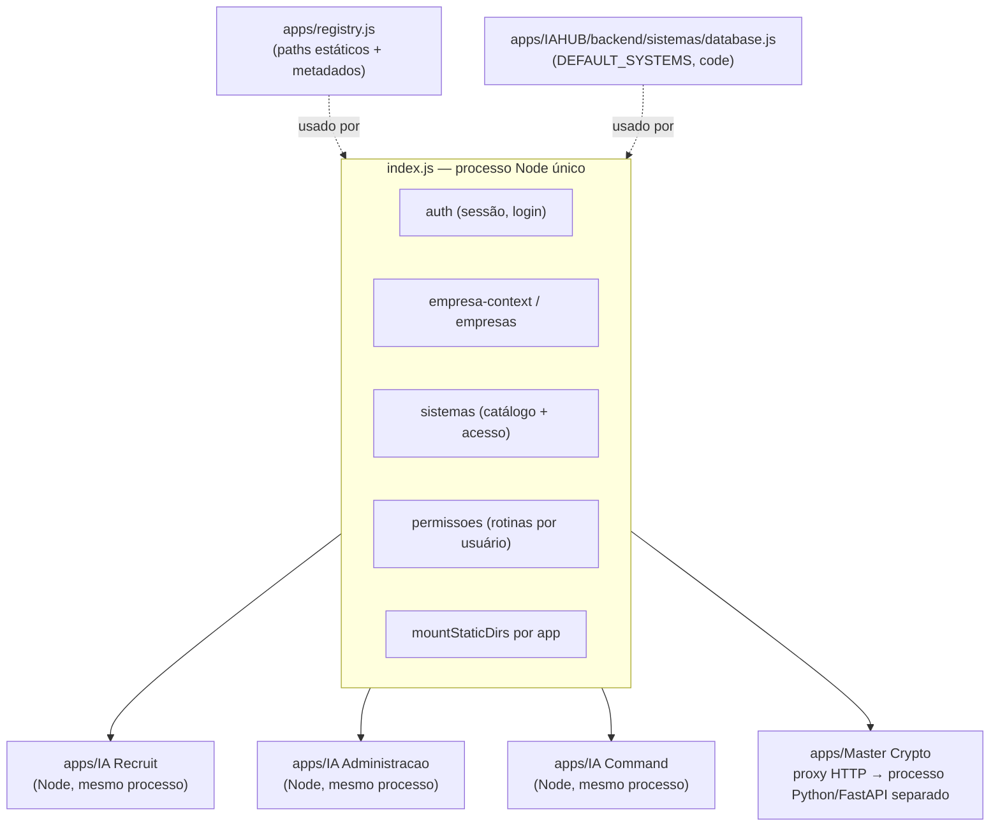
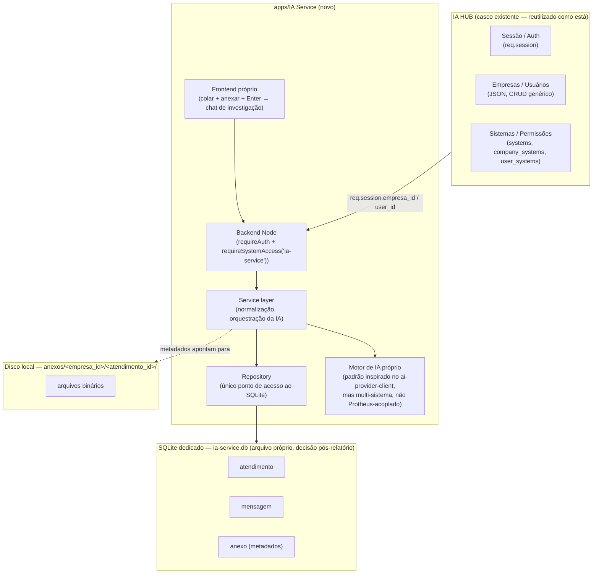
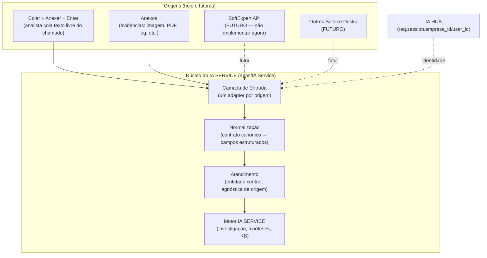

# IA SERVICE — Análise Técnica de IA HUB e IA COMMAND

**Etapa 0 — Somente leitura e análise. Nenhum código foi alterado.**
Data da análise: 2026-09-23 (revisão 2 — decisão de persistência atualizada)
Repositório: `c:\Apps\iahub` (branch `feature/ia-command-multi-turn`)

> **Nota de revisão**: após leitura deste relatório, o time decidiu **não usar Supabase no MVP** do IA SERVICE — a persistência inicial será **SQLite + `better-sqlite3`**, seguindo o padrão já validado no IA Command. As seções abaixo foram atualizadas para refletir essa decisão; onde a análise original sobre Supabase permanece factualmente correta (ele continua não integrado ao ecossistema hoje), o texto foi preservado como contexto, mas a recomendação de uso para o IA SERVICE mudou. A experiência do MVP também mudou: em vez de formulário obrigatório, o fluxo é **colar + anexar + Enter**, com anexos entrando no MVP (não mais pós-MVP).

---

## 1. RESUMO EXECUTIVO

O IA HUB é um monólito Node.js/Express que hospeda múltiplos "apps" (IA Command, IA Recruit, IA Administração, Master Crypto) sob um casco comum de autenticação, empresas, permissões e menu. Esse casco é **real e reutilizável**, mas é 100% caseiro: sessão de servidor via `express-session` com store em arquivo, empresas/usuários/permissões em arquivos JSON (sem banco relacional no core), e integração entre apps feita por fiação manual em pelo menos 6 a 9 pontos do código (não há plugin/auto-discovery).

O IA Command — apontado no briefing como referência técnica — tem dois núcleos muito diferentes em maturidade:

- **O motor de IA (NL→SQL sobre Protheus)** é sofisticado: classificação de intenção, merge de contexto conversacional, spec por módulo, guardrails de SQL, retry corretivo guiado por IA, multiempresa/multi-filial (inclusive o modelo LOBO_GUARA), e tracking de custo por evento. Isso é o ativo mais valioso do IA Command e é genuinamente reaproveitável como **padrão de arquitetura** para o IA SERVICE — não como código a importar diretamente, pois está fortemente acoplado a Protheus/SX2/SX3.
- **O chat como experiência de produto** é modesto: um único arquivo HTML de 7608 linhas sem framework, sem streaming, sem cancelamento, sem markdown, sem upload de anexo para a IA. A "memória conversacional" não é um histórico de mensagens enviado ao LLM — é um objeto de intenção estruturada (`intent_json`) com TTL de 10 minutos. Isso é *o oposto* do que o documento de briefing presumia como ponto de partida ("chat maduro para estudar profundamente"): a UX existe e funciona, mas não é um chat "tipo ChatGPT" — é um formulário conversacional de investigação de dados.

**O achado mais importante e que contraria uma premissa explícita do briefing**: o Supabase **não está integrado ao ecossistema hoje**. Não há client SDK, não há schema versionado, não há RLS, não há Storage, não há Auth do Supabase em uso. A única presença é um projeto Supabase provisionado e parcialmente conectado ao app Master Crypto via dois scripts Python utilitários (não runtime de produção), com uma credencial de conexão exposta em texto claro no código-fonte desses scripts. Adotar Supabase para o IA SERVICE é, portanto, uma decisão nova — não uma continuação de um padrão já validado em produção.

Consequência direta para a Decisão 5 do briefing ("Supabase será usado pelo IA SERVICE"): tecnicamente possível, mas exige decidir também **como o Supabase vai coexistir com a autenticação/multiempresa 100% caseira do IA HUB**, já que hoje nada no ecossistema faz essa ponte. Isso é detalhado nas seções 11, 13 e 25.

---

## 2. STACK TECNOLÓGICA ENCONTRADA

| Camada | Tecnologia | Observação |
|---|---|---|
| Backend core (IA HUB) | Node.js + Express 4 | Monólito único, `index.js` de 723 linhas |
| Sessão | `express-session` + store customizado em arquivo | Não é Redis, não é Supabase Auth |
| Persistência core (empresas/usuários/permissões) | Arquivos JSON via CRUD genérico | Sem banco relacional no core |
| Persistência IA Command | SQLite (`better-sqlite3`) | Arquivo `ia-command.db`, migrations versionadas próprias |
| Persistência IA Recruit | Arquivos JSON por empresa | `empresa_<id>.json`, `ia-usage-<id>.json` |
| Backend Master Crypto | Python + FastAPI | Processo separado, proxied pelo Express |
| Persistência Master Crypto | Arquivo JSON (`CompanyStore`) | Apesar de ter Supabase parcialmente provisionado |
| Frontend (geral) | HTML/CSS/JS vanilla, sem framework | Sem React/Vue/Next em nenhum app |
| Frontend do chat IA Command | HTML único de 7608 linhas | `protheus-chat.html`, sem componentização |
| Grid/tabelas | Tabulator (lib externa) | Usado para dados tabulares fora da bolha de chat |
| Realtime | Socket.IO | Usado para eventos operacionais (status WhatsApp), não para tokens de chat |
| IA — providers | Groq, DeepSeek, OpenAI, Claude (Anthropic), Gemini | Chamados via HTTPS cru (`https.request`), não SDKs oficiais, no motor do IA Command |
| IA — providers (IA Recruit) | Groq + Gemini via SDKs oficiais | Motor totalmente separado do IA Command |
| Banco de dados do ERP consultado | SQL Server (Protheus) | Acesso via agente/ODBC próprio |
| Supabase | Provisionado, quase não integrado | Ver seção 11 — **decisão: não usar no MVP do IA SERVICE** |
| **Persistência do IA SERVICE (decidido)** | **SQLite + `better-sqlite3`** | Mesmo padrão do IA Command — banco próprio, arquivo dedicado, migrations versionadas |

---

## 3. ARQUITETURA DO IA HUB



O "core" (`apps/IAHUB/backend`) resolve autenticação, seleção de empresa, catálogo de sistemas e permissões de rotina. Cada app roda **no mesmo processo Node** (exceto Master Crypto, que é um processo Python separado, proxied). Não há microserviços nem gateway — é um monólito modular por convenção de pasta.

### 3.1 Ponto de entrada e ordem de boot
`index.js` carrega `.env`, monta `helmet` + rate limit global, configura sessão compartilhada entre Express e Socket.IO, inicializa dados default (admin, config, sistemas) e então registra sequencialmente: auth → configurações → ia (re-export) → empresa-context → empresas → usuários → permissões → sistemas → segurança → **IA Command** → **Master Crypto** → módulos legados de recrutamento.

### 3.2 `apps/registry.js` — registro de apps (só estático, não é router)
Mapa `APPS` com `code`, `rootDir`, `frontendDir`, `backendDir`, `staticDirs` por app. O `code` de cada entrada (ex. `iaRecruit.code === 'recrutamento'`, mantido por compatibilidade histórica) precisa **bater manualmente** com o `code` cadastrado em `DEFAULT_SYSTEMS` (`apps/IAHUB/backend/sistemas/database.js`) — são dois registros paralelos sem validação cruzada automática.

### 3.3 `modules/` — camada de compatibilidade, não código-fonte novo
Confirmado por leitura direta: `modules/auth`, `modules/empresa-context`, `modules/sistemas`, `modules/permissoes`, `modules/ia` etc. são **stubs de 1 linha** (`module.exports = require('../../apps/IAHUB/backend/...')` ou, no caso de `modules/ia`, apontando para `apps/IA Recruit/backend/ia`). O próprio `ARCHITECTURE.md` do repositório instrui: *"Novos recursos devem nascer dentro de `apps/<Sistema>` ou `packages/<pacote>`, não em `modules/`"*. **Implicação direta para este projeto: o IA SERVICE deve nascer em `apps/IA Service/`, nunca em `modules/`.**

### 3.4 `packages/` — bibliotecas compartilhadas (parcialmente vazias)
- `packages/ui/frontend/` — **real**: CSS do design system (`iahub.css`) + 3 helpers JS genéricos (grid-group-panel, rich-text, audit-fields). Não contém componente de sidebar/menu.
- `packages/auth/frontend/js/auth.js` — **real e central**: ~880 linhas, é o "kernel" client-side de sessão/empresa/rotinas, carregado via `<script>` em toda página HTML da plataforma.
- `packages/api-client/`, `packages/permissions/`, `packages/types/` — **contêm apenas `README.md`**, sem nenhum código. São aspiracionais. Se o relatório do IA SERVICE assumir "vamos usar o cliente HTTP compartilhado" ou "a lib de permissões compartilhada", isso **não existe hoje** e precisaria ser criado do zero (ou o IA SERVICE segue replicando o padrão atual de cada app reimplementar sua própria chamada).

### 3.5 Menu / sidebar — não é compartilhado, é duplicado por app
Cada app (IA Command, IA Recruit, Master Crypto) mantém seu próprio `frontend/js/sidebar.js` com um array `MENU` hardcoded, filtrado no cliente por `window._iahubRotinas`. Não existe um componente de menu único renderizado a partir de uma fonte central — um app novo precisa criar seu próprio `sidebar.js` do zero, seguindo o padrão observado.

### 3.6 Passos reais para integrar um app novo (reconstruído a partir do precedente Master Crypto)
Não existe script gerador nem "how-to" formal. Pelos exemplos existentes, integrar um app novo hoje exige editar manualmente pelo menos:
1. `apps/registry.js` (nova entrada `APPS.iaService`)
2. `apps/IAHUB/backend/sistemas/database.js` (`DEFAULT_SYSTEMS`, mesmo `code`)
3. `index.js` (criar `requireIaService`, montar `mountStaticDirs`, registrar rotas)
4. `apps/IAHUB/backend/permissoes/system-routines.js` (`systemActiveFromRotinas` — convenção de prefixo tipo `iac-*`/`mc-*`, precisaria de um prefixo próprio, ex. `svc-*`)
5. `apps/IA Service/frontend/js/sidebar.js` (menu próprio, do zero)
6. `packages/auth/frontend/js/auth.js` (`_PAGINA_ROTINA`, `_ROTINA_LABELS` — mapeamento página→rotina para controle de acesso client-side)
7. `apps/IAHUB/frontend/iahub.html` (`SYSTEM_ICONS`, `DEFAULT_SYSTEM_CARD_IMAGES` — branding do card no launcher)

Isso é uma dívida técnica relevante (ver seção 19), mas é o padrão real e vigente — o IA SERVICE deve segui-lo por consistência, exceto se o time decidir investir em consolidar esses pontos primeiro (fora do escopo desta etapa).

---

## 4. EMPRESAS, USUÁRIOS E AUTENTICAÇÃO

### 4.1 Autenticação — sessão de servidor, não JWT, não Supabase Auth
`apps/IAHUB/backend/auth/`: login via `bcryptjs.compare` contra `senha_hash`; sucesso chama `req.session.regenerate()` e popula `req.session.{authenticated, user, user_id, role, empresas}`. Logout via `req.session.destroy()`. Sessão persistida em **arquivos `.json`** por sessão (`FileSessionStore` customizado, não Redis, não MemoryStore padrão), cookie `httpOnly`, `sameSite: 'strict'`, 30 dias. Rate limit anti-bruteforce em memória por IP.

Não existe `req.user` (não usa Passport) — toda a plataforma lê `req.session.*` diretamente. No frontend, `packages/auth/frontend/js/auth.js` expõe `window._iahubUser`/`window._iahubEmpresa` após `fetch('/api/me')`.

### 4.2 Empresas — resolução por request
Fonte primária: `req.session.empresa_id`, setada em `POST /api/empresas/selecionar`. Existe um modo MDI (múltiplas abas) em que `empresa_id` explícito na query/body tem prioridade sobre a sessão, desde que o usuário tenha acesso validado a essa empresa (`hasCompanySystem` + `hasUserSystem`).

**Isolamento entre empresas não é RLS de banco — é filtro manual em cada camada de código** (cada app filtra `WHERE empresa_id = ?` ou separa arquivo por empresa). Não há uma camada única que garanta isso automaticamente; depende de cada desenvolvedor lembrar de filtrar. Um middleware genérico (`requireEmpresa`) existe mas hoje só garante que *alguma* empresa foi selecionada — não filtra dados. O próprio código documenta isso como incompleto: comentário *"Phase 3: infraestrutura pronta — aplicação às rotas de dados na Fase 5"*, sugerindo que o rollout planejado não foi concluído.

### 4.3 Permissões — três tabelas JSON encadeadas
`systems.json` (catálogo) → `company_systems.json` (sistema habilitado por empresa) → `user_systems.json` (sistema habilitado por usuário+empresa) → `permissoes.json` (rotinas/telas específicas por usuário+empresa). Regra de decisão em cascata: sistema ativo globalmente **e** empresa tem o sistema **e** usuário tem o sistema nessa empresa (ou é admin). Middleware `requireSystemAccess(systemCode)` aplica essa cascata tanto a páginas HTML quanto a prefixos de API.

### 4.4 O que o IA SERVICE deve reutilizar aqui
Tudo isso (sessão, `req.session.empresa_id`, `hasCompanySystem`/`hasUserSystem`, `requireSystemAccess`) é o padrão real vigente e **deve ser reutilizado como está** — é exatamente o "controle de empresas/usuários" que o briefing pede para não duplicar. O IA SERVICE só precisa: (a) se registrar como um novo `system_code` no catálogo, (b) usar `requireAuth` + `requireSystemAccess('ia-service')` nas suas rotas, (c) ler `req.session.empresa_id`/`user_id` como todo o resto da plataforma já faz.

---

## 5. COMO UM SISTEMA É INTEGRADO AO IA HUB

Já detalhado na seção 3.6. Dois modelos de implementação observados:

- **Modelo A (Node no mesmo processo)** — IA Command: rotas registradas diretamente em `index.js`, tudo roda no processo Express principal.
- **Modelo B (serviço externo com proxy)** — Master Crypto: backend próprio (Python/FastAPI), gerenciado por um `service-manager.js` que faz `spawn()`/health-check, e o Express expõe só um proxy genérico que repassa headers de identidade (`x-iahub-company-id`, `x-iahub-user-id`).

O Modelo B é relevante se o IA SERVICE vier a ter stack própria diferente de Node — é um precedente testado no próprio repositório.

---

## 6. ARQUITETURA DO IA COMMAND

```
apps/IA Command/
├── frontend/                    # ~40 páginas ADMINISTRATIVAS (config, monitor, dashboards) — não é o chat
├── modules/
│   ├── routes.js                # registro central de rotas do app
│   ├── database/                # SQLite (better-sqlite3) + migrations versionadas próprias
│   ├── protheus_whatsapp/       # ★ O CHAT DE FATO — canal "Protheus Chat" embutido no ERP + WhatsApp
│   │   ├── routes.js            # 2188 linhas, todos os endpoints do chat
│   │   ├── service.js           # orquestração de processarMensagem()
│   │   ├── session-store.js     # CRUD de sessões/mensagens/favoritos
│   │   ├── token-service.js     # auth própria do chat (token de sessão, não sessão do IAHub)
│   │   └── public/protheus-chat.html   # ★★★ TODO o frontend do chat — 7608 linhas, um arquivo só
│   ├── ai/                      # pipeline de IA: intent-service, intent-merger, providers/, prompts/
│   │   └── chat/                # ⚠ pipeline alternativo ÓRFÃO (chat-service.js) — ver seção 8
│   ├── erp/                     # camada Protheus: SX2/SX3, guards, specs por módulo, ia-owner/runner.js
│   └── whatsapp/                # canal WhatsApp real (separado do chat embutido no ERP)
```

**Achado estrutural importante**: o "chat" do IA Command não é uma tela dentro do painel administrativo do IA HUB — é uma página própria (`protheus-chat.html`), servida via autenticação própria por token (emitida por rotina ADVPL do Protheus ou por login OTP via WhatsApp), consumida dentro de um webview embutido no ERP (`TWebEngine`) ou por link web direto. **Não passa pela sessão do IA HUB.** Isso é uma diferença de modelo de identidade que o IA SERVICE precisa decidir resolver de forma diferente, já que o briefing pede um "analista" logado no IA HUB abrindo o atendimento — mais próximo do modelo de sessão do IA HUB do que do modelo de token do chat Protheus.

---

## 7. ARQUITETURA DO CHAT

### 7.1 Sidebar / lista de conversas
`renderSessionList()` no HTML único, populada por `GET /api/ia-command/protheus/sessoes`. Cada item mostra título (auto-gerado da primeira pergunta), preview da última mensagem, timestamp relativo, indicador de "processando" e "não lida", menu de renomear/excluir.

### 7.2 Busca
Client-side apenas, filtra por título e preview já carregados em memória — **não busca no conteúdo completo das mensagens nem no servidor**.

### 7.3 Favoritos
Modal próprio, busca própria, permite reexecutar uma pergunta favoritada sem reprocessar IA (usa o SQL já auditado).

### 7.4 Mensagens / bubbles
`addBubble()`: bolha `out` (usuário) / `in` (IA). **Sem markdown, sem highlight de código** — texto passa por `escapeHtml` puro, decisão deliberada e documentada no código (comentário datado, revertido a pedido do usuário: *"Bolha volta a mostrar o TEXTO COMPLETO... sem resumo nem mini-grid próprios deste canal"*). Existe um formato "estruturado" opcional (`apresentacao`) com blocos de métricas/resumo/sugestão, mas ainda sem parsing de markdown. **Dados tabulares não aparecem na bolha** — só um link "Ver na aba Dados", que abre uma aba separada com grid Tabulator (agrupamento, filtro, export Excel/PDF).

### 7.5 Composer
Textarea com auto-resize, Enter envia / Shift+Enter quebra linha, rascunho por conversa persistido em memória local.

### 7.6 Streaming
**Não existe.** `fetch` síncrono aguardando JSON completo; indicador "digitando" é puramente local (não reflete chunks reais).

### 7.7 Cancelamento
**Não existe.** Sem `AbortController` em nenhuma camada.

### 7.8 Erro
Banner global + bolha de erro específica na conversa (classe `bubble-falha`), com mensagens sempre em pt-BR e nunca expondo exceção técnica crua ao usuário.

### 7.9 Anexos
**Não existe upload de anexo como entrada para a IA.** O que existe é encaminhamento de arquivo local (até 10 MB) para um contato do WhatsApp — funcionalidade de saída, não de entrada para investigação.

### 7.10 Responsividade
Cobertura extensa de media queries no próprio HTML — sidebar vira drawer no mobile, toolbar rola horizontalmente, fontes da grid reduzidas.

### 7.11 Reaproveitamento honesto
Não há componentes React/Vue extraíveis — é HTML monolítico. **Qualquer reuso visual exigirá reescrita em componentes**, não importação direta de arquivo. O que é reaproveitável é o *padrão de interação* (sidebar + composer + aba de dados separada da conversa) e o *modelo de dados* (sessão → mensagens → favoritos), não o código-fonte do HTML em si.

---

## 8. FLUXO COMPLETO DE UMA MENSAGEM

```mermaid
sequenceDiagram
    participant U as Usuário (browser/TWebEngine)
    participant FE as protheus-chat.html
    participant RT as routes.js (POST /mensagem)
    participant SV as service.js (processarMensagem)
    participant IS as intent-service.js
    participant IM as intent-merger.js
    participant RO as intent-router.js
    participant RU as ia-owner/runner.js
    participant AP as ai-provider-client.js
    participant PR as Provider (Groq/Claude/...)
    participant DB as SQL Server (Protheus)
    participant ST as session-store.js (SQLite)

    U->>FE: digita e envia texto
    FE->>FE: addBubble (otimista) + showTyping()
    FE->>RT: POST /api/ia-command/protheus/mensagem {texto, sessaoId, empresaId}
    RT->>RT: requireTokenSessao (auth própria do chat)
    RT->>SV: processarMensagem(...)
    SV->>ST: ultimoIntent(sessaoId)  — contexto anterior
    SV->>IS: classificar(texto, empresaId, {contextoAnterior})
    IS->>AP: chamarIA(...) [classificação de intenção]
    AP->>PR: HTTPS cru (fallback em cascata entre providers)
    PR-->>AP: JSON estruturado
    SV->>IM: mesclar(intent, contextoAnterior)  — herança/refinamento
    SV->>RO: rotear(intent, empresaId)
    RO->>RU: executar(spec, intent, empresaId)  [caminho AI-SQL / IA-OWNER]
    RU->>RU: injeta SX2/SX3, monta system+user prompt
    RU->>AP: chamarIaOwner(...)
    AP->>PR: HTTPS cru
    PR-->>AP: {sql, entidades_necessarias?, ...}
    opt entidades a resolver
        RU->>DB: resolve cadastro real
        RU->>AP: reenvia prompt com códigos resolvidos
    end
    RU->>RU: valida SQL (40+ validações); se falhar, retry corretivo guiado por IA
    RU->>DB: executa SQL final (ODBC/agente)
    DB-->>RU: rows
    RU-->>SV: resposta formatada (texto + rows)
    SV->>ST: salvarTurno(pergunta+resposta+intent+rows)
    SV->>SV: registrarInterpretacao (log/aprendizado)
    SV-->>RT: resultado
    RT-->>FE: res.json({sessaoId, resposta})
    FE->>FE: hideTyping() + addBubble(resposta completa)
```

Nenhuma etapa usa streaming; a resposta só chega ao frontend depois de todo esse pipeline (classificação → merge → roteamento → geração de SQL → validação/retry → execução real no Protheus → formatação) — é uma requisição HTTP síncrona, potencialmente de vários segundos.

---

## 9. MOTOR DE IA

### 9.1 Dois motores de IA distintos e desconectados no mesmo monorepo
- **`modules/ia` do core** aponta (via re-export) para `apps/IA Recruit/backend/ia` — o motor de IA do **IA Recruit** (triagem de currículos), com apenas Groq + Gemini via SDKs oficiais, usage tracking em JSON. **Não é usado pelo IA Command.**
- **O motor real do IA Command** vive em `apps/IA Command/modules/ai/` + `apps/IA Command/modules/erp/{core,ia-owner}/` — muito mais sofisticado, 5 providers via HTTPS cru, usage tracking em SQLite com custo estimado por evento.

Isso significa que "o motor de IA do IA HUB" não existe como coisa única — são dois sistemas paralelos. O IA SERVICE não herda automaticamente nada só por estar no mesmo repositório; precisa decidir explicitamente de qual motor (se algum) parte.

### 9.2 Providers e seleção de modelo
`apps/IA Command/modules/erp/core/ai-provider-client.js`: Groq (`gpt-oss-20b`), DeepSeek, OpenAI (`gpt-4o-mini`), Claude (`claude-haiku-4-5`), Gemini (`gemini-3.5-flash`). Chaves e ordem de fallback são **configuráveis por empresa** (tabela `ai_config`), com cascata de resolução: config da empresa → config genérica do IAHub core → variáveis de ambiente → config de qualquer empresa cadastrada (fallback "fail-open" documentado no código). Modelo específico por provider também é configurável por empresa.

**Ponto de atenção de segurança**: todas as chamadas HTTPS usam `rejectUnauthorized: false` (validação de certificado TLS desabilitada) — vale corrigir se essa camada for reaproveitada.

### 9.3 System prompts e injeção de contexto técnico
Prompt fixo (~270 linhas de regras gerais: sintaxe SQL Server, formato de data Protheus, proibições, regras de granularidade) + trechos dinâmicos por módulo (spec `*-ia-owner-spec.js`) + injeção de metadados reais do Protheus (SX2 = tabela física/sufixo por empresa, SX3 = campos/tipos, limitados a ~80 campos por tabela para caber no prompt) + instruções de alta prioridade postas no topo do prompt (ex. nomes de filial que não devem virar filtro), porque o time já constatou em produção que instruções "enterradas" no meio do prompt são ignoradas pela IA.

Existe um mecanismo de **autoedição de spec por feedback aprovado por humano** (`spec-fragment-applier.js`): quando a IA erra recorrentemente, um admin aprova uma correção e o sistema reescreve literalmente uma função no arquivo de spec — só para funções simples, sem parâmetros. É o "spec do IA-OWNER" citado no CLAUDE.md do projeto.

### 9.4 Streaming
**Não existe em nenhum dos dois motores.** Nem o backend pede `stream: true` ao provider, nem o frontend consome `ReadableStream`/SSE.

### 9.5 Tool calling
**Não usa tools/function calling nativo de nenhum provider.** O "comportamento agente" (resolver entidade, corrigir SQL com erro) é orquestração manual em JavaScript: o backend interpreta um JSON estruturado retornado pela IA (`sql`, `entidades_necessarias`) e decide programaticamente os próximos passos, incluindo reenviar um novo prompt corretivo. Migrar para tool calling nativo é uma simplificação real disponível para o IA SERVICE, não uma herança do IA Command.

### 9.6 Retry, timeout, fallback
- Fallback entre providers em cascata, com blocklist em memória do processo para erros de "payload grande" (não retenta o mesmo provider na sessão do processo) mas não para erros de cota/rate-limit (considerados temporários).
- Timeout por chamada: 30–45s dependendo do caminho.
- **Retry corretivo guiado por IA**: quando o SQL gerado falha em validação determinística ou na execução real, o erro é formatado e reenviado à própria IA como instrução de correção — mais de 40 funções de validação (`validar*`) no `runner.js`, com número de tentativas variável por contexto.
- Retry de infraestrutura (reset de socket/pool ODBC) é separado, sem nova chamada à IA, com espera fixa de 2s.
- **Cancelamento: não implementado em lugar nenhum.**

### 9.7 Custo e uso
Dois sistemas de tracking desconectados (SQLite rico por evento no IA Command; JSON simples mensal no IA Recruit), com providers e preços hardcoded diferentes em cada um. Se o IA SERVICE quiser visão de custo consolidada do ecossistema, os dois precisam ser unificados — não existe isso hoje.

### 9.8 Temperature e parâmetros
Sempre `temperature: 0` no motor do IA Command (determinismo para gerar SQL). `max_tokens` varia por spec/chamada (2000–3500). Sem `top_p`/`top_k`/penalties configurados.

---

## 10. CONTEXTO E HISTÓRICO DAS CONVERSAS

Esta é a seção que mais diverge do que o briefing presumia. **O IA Command não envia histórico de mensagens ao LLM a cada request.** O "contexto" é um objeto de intenção estruturada (`intent_json`: módulo, período, filtros, agrupamento, SQL canônico), não texto de conversa.

Fluxo: a cada mensagem, busca-se **apenas o último `intent_json`** salvo na sessão (`sessionStore.ultimoIntent`), não uma janela de N mensagens. Esse contexto é fundido com o novo intent classificado por `intent-merger.js`, que implementa exatamente as 9 regras de "Controle de Contexto Conversacional" descritas no CLAUDE.md do projeto (herança de período/filtro se não redefinido, "detalhar"/"por mês" vira GROUP BY sem tocar WHERE, prioridade usuário > conversa > contexto anterior > domínio, reset explícito por "RESET" ou por inatividade).

**TTL de contexto**: 10 minutos de inatividade zera o intent anterior (`CONTEXT_TTL_MS`). Existe também um botão explícito "Esquecer contexto" que marca `memoria_resetada_em` na sessão sem apagar as mensagens visuais — o histórico continua visível, mas deixa de alimentar o próximo turno.

Não há sumarização de texto nem contagem dinâmica de tokens — o "controle de tamanho de contexto" é, na prática, o fato de nunca se enviar texto de conversa bruto, só o objeto estruturado + limite fixo de campos SX3 por tabela.

**Existe um segundo mecanismo, órfão, que faz o oposto** (`modules/ai/chat/chat-service.js` + `chat-history.js`): monta `messages[] = [system, ...histórico, user]` com até 5 turnos, no estilo "chat multi-turno nativo" comum em produtos de IA modernos. Confirmado por busca exaustiva que **nenhum outro arquivo do sistema o importa** — não está conectado a nenhuma rota ativa. É relevante para o IA SERVICE como *protótipo de referência* de um design alternativo (histórico bruto em vez de intent estruturado), mas não deve ser presumido como validado em produção.

Não há memória entre sessões diferentes — trocar de conversa zera o contexto; a única persistência cross-sessão é favoritos e cache de permissões.

---

## 11. SUPABASE

> **Decisão do time (pós-relatório)**: o IA SERVICE **não usará Supabase no MVP** — a persistência será SQLite (seção 20-A). Esta seção permanece no relatório porque os achados abaixo continuam factualmente válidos sobre o estado do ecossistema e explicam por que a mudança de decisão é coerente com o que já existe: o Supabase nunca foi, de fato, um padrão validado em produção neste repositório.

Achado central (detalhado pelo agente de investigação dedicado): **o Supabase não é usado como infraestrutura de dados do ecossistema hoje.**

- Nenhuma ocorrência de `@supabase/supabase-js`, `supabase.auth.*`, `supabase.storage.*`, Edge Functions ou Realtime em nenhum lugar do código-fonte (busca exaustiva, excluindo `node_modules`).
- A única presença é no app **Master Crypto** (`apps/Master Crypto/backend-python`), via dois scripts Python utilitários (`migrate_supabase.py`, `test_db.py`) que conectam direto via `asyncpg` (driver Postgres cru) ao pooler do Supabase — **não fazem parte do runtime da API**, são scripts de setup manual.
- O `CompanyStore` real do Master Crypto (persistência ativa) usa **arquivo JSON local**, não o Supabase provisionado.
- Variáveis `SUPABASE_URL`/`SUPABASE_ANON_KEY` existem em `.env`/`.env.example`, mas não há `SUPABASE_SERVICE_ROLE_KEY` (nem equivalente) em lugar nenhum.
- **Problema de segurança encontrado (não corrigido nesta etapa, apenas documentado)**: os dois scripts citados têm a connection string completa do pooler Supabase (usuário + senha) **hardcoded em texto claro no código-fonte versionado**. Recomenda-se rotacionar essa credencial antes de reaproveitar esse projeto Supabase para o IA SERVICE.
- Não há pasta `supabase/migrations` no repositório. Uma migration é referenciada por caminho relativo em `migrate_supabase.py` (`20260914000000_initial_schema.sql`) mas **o arquivo não existe no working tree nem no histórico do git** — foi aplicada uma vez manualmente contra o banco remoto, fora de controle de versão.
- Sem RLS, sem policies, sem Storage, sem Functions, sem Realtime documentados ou versionados no repositório.

**Ativo real reaproveitável**: o projeto Supabase já provisionado (`bbxbwnjrsdlnlkyjebio`) existe e pode ser usado como Postgres hospedado no futuro — mas partindo do zero em termos de schema, client e integração de auth/multiempresa com o resto do ecossistema. Com a decisão de usar SQLite no MVP, esse ativo fica em standby; a credencial exposta em texto claro (documentada abaixo) continua sendo uma dívida de segurança a resolver independentemente da decisão do IA SERVICE, porque o projeto Supabase segue vinculado ao Master Crypto.

---

## 12. TABELAS RELEVANTES EXISTENTES

Nenhuma tabela Supabase pôde ser confirmada a partir do código (seção 11). As tabelas relevantes que **existem de fato** estão em SQLite (IA Command) ou JSON (core/IA Recruit):

**SQLite — `apps/IA Command/modules/database/migrations.js`** (schema real, versionado):
- `protheus_chat_sessions` (id, empresa_id, celular, titulo, criado_em, atualizado_em, memoria_resetada_em)
- `protheus_chat_messages` (id, sessao_id FK, direcao, texto [criptografado], rows_json [criptografado], intent_json, grid_config_json, interpretation_log_id, criado_em)
- `protheus_chat_favorites` (id, empresa_id, celular, titulo, pergunta_texto, sql_final_executado, intent_json, ativo, ...)
- `protheus_chat_tokens`, `protheus_chat_forwardings`, `protheus_web_login_challenges`
- `ai_config` (chaves de API e ordem de fallback por empresa)
- `ia_usage_events`, `ia_usage_pricing` (tracking de custo por evento)
- `chat_history` — tabela genérica do pipeline **órfão** (seção 10), `{id, empresa_id, sender, role, content, criado_em}`
- `protheus_sx2`, `protheus_sx3` — metadados de schema do Protheus (mencionados no CLAUDE.md do projeto, confirmados em uso pelo `runner.js`)

**JSON — `apps/IAHUB/data/`**: `empresas.json`, `usuarios.json`, `permissoes.json`, `systems.json`, `company_systems.json`, `user_systems.json`, `seguranca.json`, `config-sistema.json`, `config-empresa-<id>.json`.

Todas essas são estruturas internas de cada app — nenhuma está no Supabase.

**Para o IA SERVICE (decisão pós-relatório)**: o padrão a seguir é o mesmo do IA Command — um arquivo SQLite próprio e dedicado (ex. `apps/IA Service/data/ia-service.db`), com migrations versionadas no mesmo estilo de `apps/IA Command/modules/database/migrations.js` (tabela `schema_migrations` com `version`/`descricao`/`aplicado_em`). **Nunca abrir/gravar diretamente no arquivo `ia-command.db`** — são bancos fisicamente separados, um por app, replicando o isolamento de processo já observado entre IA Command e o resto da plataforma. Ver seção 20-A para o desenho de tabelas recomendado.

---

## 13. SEGURANÇA / MULTIEMPRESA (SQLite — sem RLS de banco)

- **RLS de banco: não existe em lugar nenhum do ecossistema** (nem SQLite nem o Supabase provisionado tem policies versionadas) — e **SQLite não suporta RLS nativamente**, então essa questão fica resolvida pela própria escolha de tecnologia: o isolamento do IA SERVICE será, por definição, **responsabilidade da camada de aplicação**, igual ao resto da plataforma.
- Isolamento multiempresa é **inteiramente responsabilidade da camada de aplicação**: filtro manual `WHERE empresa_id = ?` em cada query SQLite, ou arquivo JSON separado por empresa no core. Confirmado em múltiplos pontos do `admin-routes.js` do IA Command. **O IA SERVICE deve seguir exatamente esse padrão** — toda query da camada Repository (seção 20-B) filtrando por `empresa_id` obtido de `req.session`, nunca de input do cliente sem validação.
- Resolução de "quais empresas o usuário pode acessar" vem de `req.session.empresas` (lista de IDs ou string `'all'` para admin), validada contra a empresa solicitada antes de aceitar qualquer `empresa_id` explícito de query/body.
- Campos sensíveis do chat (texto de mensagens, rows, intents, dados de favoritos) são **criptografados em repouso** via `modules/security/chat-secure-fields.js` — um padrão de segurança real, já usado em SQLite pelo próprio IA Command, e diretamente reaproveitável pelo IA SERVICE sem nenhuma dependência de Supabase.
- Com a decisão de usar SQLite, o IA SERVICE **não é mais "a primeira vez que RLS é usado"** — ele segue o padrão de segurança já validado em produção pelo IA Command (filtro em aplicação + criptografia de campos sensíveis em repouso), reduzindo o risco identificado antes na seção 18.2 do relatório original.

---

## 14. ANEXOS

> **Decisão do time (pós-relatório)**: anexos passam a fazer parte do MVP (não mais pós-MVP) — são evidência central do fluxo "colar + anexar + Enter" (seção 22-A). Isso muda a classificação desta seção na matriz (seção 17) de "criar novo, pós-MVP" para "criar novo, MVP".

Não existe, em nenhum lugar do IA Command, upload de anexo como entrada de investigação para a IA. O único mecanismo de "anexo" é saída: encaminhar um arquivo local (até 10 MB, convertido em base64) para um contato do WhatsApp, ou gerar PDF/Excel a partir de dados tabulares de uma resposta e encaminhar. **Isso precisa ser construído do zero para o IA SERVICE.**

**Armazenamento recomendado, dado que Supabase Storage está fora de cogitação no MVP**: os arquivos binários **não devem ir para dentro do SQLite** (BLOBs grandes em SQLite degradam performance de leitura/escrita e complicam backup/tamanho de arquivo). O padrão mais próximo já usado no ecossistema é o de `apps/IAHUB/backend/data-paths.js` — diretório de dados local por app (`APP_DATA_DIR`), com fallback de diretório legado. Recomenda-se replicar esse padrão: um diretório dedicado do IA SERVICE no disco (ex. `apps/IA Service/data/anexos/<empresa_id>/<atendimento_id>/`), com o SQLite guardando apenas metadados — nome original, nome interno gerado (nunca reaproveitar o nome enviado pelo cliente como nome de arquivo em disco), tipo MIME detectado no servidor (não confiar no MIME declarado pelo cliente), tamanho, caminho relativo, `usuario_id`/`empresa_id`, timestamp. Extensões e tipos MIME devem ser validados contra uma allowlist (imagem, PDF, TXT, LOG, JSON, XML — conforme a decisão do time), e o nome interno deve ser gerado (ex. UUID) para eliminar risco de path traversal ou colisão de nomes.

---

## 15. COMPONENTES FRONTEND REUTILIZÁVEIS

| Componente | Onde está | Reutilizável para IA SERVICE? |
|---|---|---|
| `packages/ui/frontend/css/iahub.css` | Design system CSS | Sim, como está — é a identidade visual da plataforma |
| `packages/auth/frontend/js/auth.js` | Sessão/empresa/rotinas client-side | Sim, como está — mas precisa editar mapas internos (`_PAGINA_ROTINA` etc.) para as páginas novas |
| `grid-group-panel.js`, `audit-fields.js`, `rich-text.js` | `packages/ui/frontend/js/` | Sim, com adaptação pontual conforme necessidade |
| Sidebar/menu | Duplicado por app, sem componente genérico | Não — precisa criar um `sidebar.js` próprio seguindo o padrão |
| `protheus-chat.html` (chat inteiro) | IA Command | Não como código — é monolítico, não componentizado. Reaproveitável só como referência de padrão de interação |
| Tabulator (grid de dados) | Lib externa, já usada no IA Command | Sim, mesmo padrão de uso pode ser copiado |

---

## 16. COMPONENTES BACKEND REUTILIZÁVEIS

| Componente | Onde está | Reutilizável para IA SERVICE? |
|---|---|---|
| `requireAuth`, `requireSystemAccess`, `req.session.*` | `apps/IAHUB/backend/` | Sim, como está — é o mecanismo central que o briefing pede para reaproveitar |
| `hasCompanySystem`/`hasUserSystem` | `apps/IAHUB/backend/sistemas/database.js` | Sim, como está |
| CRUD genérico em JSON | `apps/IAHUB/backend/crud/` | Adaptação — serve para catálogos pequenos, não para volume de mensagens de chat/KB |
| `ai-provider-client.js` (multi-provider, fallback) | `apps/IA Command/modules/erp/core/` | Reutilizar o **padrão de arquitetura** (abstração de provider, cascata de chaves por empresa, fallback), não o arquivo literal — está acoplado a specs do Protheus |
| `intent-merger.js` (herança de contexto) | `apps/IA Command/modules/ai/` | Reutilizar o **padrão conceitual** (TTL, regras de herança) — a implementação é específica de intents de BI/SQL, não de atendimento técnico |
| Schema `protheus_chat_sessions/messages/favorites` | SQLite IA Command | Bom ponto de partida de modelagem, não uma tabela a importar (é Protheus-específica: `celular`, `filial_escopo_json` etc.) |
| `chat-secure-fields.js` (criptografia em repouso) | `modules/security/` | Sim, padrão a seguir se o IA SERVICE guardar dados sensíveis de atendimento |
| Modelo B de integração (proxy + service-manager) | `apps/Master Crypto/backend/` | Sim, como referência, se o IA SERVICE não for Node puro |

---

## 17. MATRIZ: REUTILIZAR / ADAPTAR / NÃO REUTILIZAR / CRIAR

**Autenticação e sessão**
Classificação: REUTILIZAR COMO ESTÁ
Motivo: `req.session`, `requireAuth`, cookie de sessão — é exatamente o mecanismo central da plataforma, sem alternativa melhor disponível internamente.

**Empresas / seleção de empresa**
Classificação: REUTILIZAR COMO ESTÁ
Motivo: `req.session.empresa_id`, fluxo de seleção, modo MDI — já maduro e usado por todos os apps.

**Sistema de permissões (systems/company_systems/user_systems/permissoes)**
Classificação: REUTILIZAR COMO ESTÁ
Motivo: cascata de acesso já testada; o IA SERVICE só precisa se cadastrar como novo `system_code`.

**`packages/ui` (CSS + helpers)**
Classificação: REUTILIZAR COMO ESTÁ
Motivo: identidade visual consistente sem custo de reescrever.

**`packages/auth/frontend/js/auth.js`**
Classificação: REUTILIZAR COM ADAPTAÇÃO
Motivo: o arquivo funciona como está, mas precisa de edições pontuais (mapas de página→rotina) para reconhecer as novas telas do IA SERVICE — não é plug-and-play sem tocar no arquivo.

**Sidebar/menu**
Classificação: CRIAR NOVO
Motivo: não existe componente compartilhado; cada app já duplica essa lógica — o IA SERVICE seguirá o mesmo padrão de duplicação por ora.

**Motor de IA (multi-provider, fallback, prompts)**
Classificação: REUTILIZAR COM ADAPTAÇÃO (como padrão arquitetural, não como import direto)
Motivo: a abstração de "múltiplos providers com fallback e chave por empresa" é sólida e vale copiar a ideia; o código está fortemente acoplado a Protheus/SX2/SX3 e não deve ser importado literalmente.

**Modelo de contexto conversacional (intent-merger)**
Classificação: NÃO REUTILIZAR DIRETAMENTE — usar como referência conceitual
Motivo: resolve um problema diferente (refinar consultas de BI) do que o IA SERVICE precisa (investigação técnica multi-turno com hipóteses/testes). O modelo de "histórico estruturado" pode inspirar, mas o objeto de domínio é outro.

**Frontend do chat (`protheus-chat.html`)**
Classificação: NÃO REUTILIZAR COMO CÓDIGO — usar como referência de padrão de interação
Motivo: monolítico, sem componentização, sem streaming/cancelamento/markdown — o IA SERVICE precisa de uma experiência mais rica (o próprio briefing cita "estados de loading", "cancelamento" como requisitos a estudar, que hoje não existem para copiar).

**Persistência de conversas/mensagens**
Classificação: REUTILIZAR O PADRÃO, NÃO O DOMÍNIO (banco próprio, SQLite)
Motivo: ver seção 20 — SQLite dedicado ao IA SERVICE (arquivo/schema próprios, decisão pós-relatório), reaproveitando o *padrão técnico* do IA Command (`better-sqlite3`, migrations versionadas, criptografia de campos sensíveis) sem reaproveitar suas tabelas nem criar dependência funcional entre os dois bancos.

**Anexos**
Classificação: CRIAR NOVO — **agora no MVP** (decisão pós-relatório, antes classificado como pós-MVP)
Motivo: não existe upload de anexo para IA em lugar nenhum do ecossistema hoje; arquivo binário fica em disco (fora do SQLite), só metadados no banco — ver seção 14.

**Base de Conhecimento / busca semântica / embeddings**
Classificação: CRIAR NOVO
Motivo: não existe nada equivalente no ecossistema — nenhum app faz busca vetorial ou RAG hoje.

**Tracking de uso/custo de IA**
Classificação: REUTILIZAR COM ADAPTAÇÃO
Motivo: existem dois modelos (SQLite rico no IA Command, JSON simples no IA Recruit); vale adotar o padrão mais rico (SQLite por evento) em vez de inventar um terceiro.

---

## 18. RISCOS DE ACOPLAMENTO

1. **Fiação manual em 6-9 pontos para registrar um app novo** (seção 3.6) — risco de esquecer um ponto e o app "quase funcionar" (aparecer no launcher mas sem rotina cadastrada, por exemplo). Sem testes automatizados que validem consistência entre `apps/registry.js` e `sistemas/database.js`.
2. **Isolamento multiempresa depende 100% de disciplina de código**, sem RLS nem ORM que force o filtro — um endpoint novo do IA SERVICE que esqueça de filtrar por `empresa_id` vaza dados entre empresas sem nenhuma rede de segurança automática. Isso vale tanto para SQLite quanto valeria para Supabase — a decisão de usar SQLite (seção 20) não elimina este risco, só o torna consistente com o padrão que o resto da plataforma já assume.
3. ~~Ponte de identidade IA HUB → Supabase~~ — **risco eliminado pela decisão de usar SQLite no MVP** (seção 20): sem Supabase, não há necessidade de propagar identidade para um serviço de auth externo; o IA SERVICE usa `req.session` como qualquer outro app do ecossistema, sem ponte adicional.
4. **Dois motores de IA desconectados já coexistem** (IA Command vs IA Recruit) — adicionar um terceiro motor próprio do IA SERVICE sem consolidação aumenta a fragmentação (3 clients HTTP a providers, 3 sistemas de tracking de custo).
5. **`rejectUnauthorized: false`** nas chamadas HTTPS a providers de IA no IA Command — se esse client for copiado como referência, essa falha de segurança não deve ser replicada.
6. **Banco SQLite por arquivo, sem servidor de banco compartilhado**: se o IA HUB rodar em múltiplas instâncias/processos no futuro (hoje não roda, é um único processo Node — seção 3), um arquivo SQLite local por instância pode divergir. Não é um risco hoje (a plataforma é monoprocesso), mas vale registrar como limitação conhecida da escolha.

---

## 19. DÍVIDAS TÉCNICAS QUE PODEM IMPACTAR O IA SERVICE

- `packages/api-client`, `packages/permissions`, `packages/types` são READMEs vazios — não contar com eles como se existissem.
- `modules/` contém tanto stubs de compatibilidade quanto código legado real ainda não migrado (ex. `modules/whatsapp-curriculo`) — confundir os dois ao procurar "onde fica X" é fácil.
- Rollout de isolamento multiempresa "Fase 3 pronta, Fase 5 pendente" (comentário no próprio código de `empresa-context`) — não presumir que filtro de empresa é automático em nenhuma rota nova.
- Pipeline órfão (`modules/ai/chat/chat-service.js`) pode confundir quem for procurar "o motor de chat" — vale confirmar com o time se é descartável ou se há intenção de retomá-lo.
- Credencial do pooler Supabase exposta em texto claro em dois scripts versionados (seção 11) — recomenda-se rotacionar antes de qualquer reuso em produção, independente da decisão sobre o IA SERVICE.
- `apps/IAHUB/data/iahub.db` (SQLite) existe fisicamente mas nenhum código o referencia — resíduo órfão de tentativa anterior, não presumir propósito.

---

## 20. RECOMENDAÇÃO: CHAT COMPARTILHADO OU ESTRUTURA PRÓPRIA

**Recomendação (atualizada): banco SQLite próprio e dedicado ao IA SERVICE — mesmo padrão tecnológico do IA Command, schema e arquivo completamente separados.** Esta seção foi revisada após a decisão do time de usar SQLite em vez de Supabase no MVP; a conclusão sobre *não reaproveitar as tabelas do IA Command* permanece a mesma, só muda a tecnologia de destino.

Fundamentação, ponderando os critérios pedidos pelo briefing original:

- **Acoplamento**: o schema do IA Command (`protheus_chat_sessions/messages`) tem campos estruturalmente presos ao domínio Protheus/WhatsApp (`celular` como chave de identidade em vez de `usuario_id`, `filial_escopo_json`, `interpretation_log_id` ligado a specs de módulo ERP). Forçar o IA SERVICE nesse schema criaria um acoplamento artificial a conceitos que não existem no domínio de atendimento técnico (que é multi-sistema por design, conforme decisão 2 do briefing). Isso vale independentemente da tecnologia de persistência escolhida.
- **Independência de evolução**: o briefing exige explicitamente que IA SERVICE não crie risco de regressão no IA Command. Um **arquivo `.db` próprio** (não apenas um schema lógico separado, mas um arquivo físico separado — `apps/IA Service/data/ia-service.db`) garante isolamento total: nenhuma migration do IA SERVICE pode, por engano, tocar uma tabela do IA Command, porque são conexões `better-sqlite3` completamente distintas.
- **Mesmo motor de banco, zero acoplamento de dados**: usar `better-sqlite3` nos dois apps não implica nenhum compartilhamento — é a mesma biblioteca Node, mas cada app abre seu próprio arquivo. Esse é exatamente o "reutilizar o padrão, não o domínio" pedido pelo time (seção 20-A detalha o desenho de tabelas).
- **O que É compartilhável, e deve ser**: a **identidade** (usuário, empresa, sessão do IA HUB) — não os dados de conversa em si. O IA SERVICE deve gravar `usuario_id`/`empresa_id` vindos de `req.session` nas suas próprias tabelas, exatamente como o resto da plataforma faz, sem duplicar cadastro de usuário/empresa.
- **Estrutura genérica compartilhada (opção C do briefing)**: não recomendada para o MVP — não existe hoje, seria trabalho novo de design (schema genérico de "conversa" reaproveitável por N sistemas) sem um segundo consumidor real ainda para validar o desenho. Considerar como evolução futura *se* um terceiro sistema de chat aparecer no IA HUB depois do IA SERVICE.

**Risco de regressão**: mínimo — zero mudança em código/schema/arquivo do IA Command. Risco de "reinventar a roda" é aceitável no MVP dado que o schema do IA Command não serve ao domínio do IA SERVICE sem descaracterizá-lo.

### 20-A. Desenho preliminar de tabelas (conceitual — nomes definitivos na etapa de implementação)

Conforme pedido pelo complemento, os nomes de tabela abaixo são **conceituais**, seguindo a convenção de nomenclatura já usada no projeto (português, `snake_case`, prefixadas para evitar colisão — o IA Command usa prefixo `protheus_chat_*`; o IA SERVICE usaria um prefixo próprio, ex. `ia_service_*` ou `atendimento_*`, a definir na implementação):

- **Atendimento** — entidade central, agnóstica de origem (`origem`, `referencia_externa` nullable, `empresa_id`, `conteudo_bruto`, `contexto_estruturado`, `contexto_origem`, `precisa_revisao`, `criado_por_usuario_id`/`criado_por_integracao`, `status`, timestamps) — já detalhada na seção 22-B (contrato canônico).
- **Mensagem** — turnos de conversa vinculados ao atendimento (`atendimento_id` FK, `direcao`, `texto`, `criado_em`), inspirada no padrão `protheus_chat_messages` mas sem os campos Protheus-específicos.
- **Anexo** — metadados de arquivo (`atendimento_id` FK, `mensagem_id` FK nullable, nome original, nome interno, MIME, tamanho, caminho em disco, `empresa_id`, `usuario_id`, timestamps) — ver seção 14.
- **Contexto** (opcional, avaliar se cabe dentro de `Atendimento.contexto_estruturado` como JSON em vez de tabela própria — decisão de implementação, não desta etapa).
- **Evento de entrada** — não implementar no MVP (seção 22-D), mas reservar conceitualmente o espaço no desenho.
- **Futuramente**: Base de Conhecimento (fora do MVP).

Todas as tabelas levam `empresa_id INTEGER NOT NULL` (padrão já usado em toda tabela do IA Command) e devem ser sempre filtradas por ele na camada Repository (seção 20-B) — não há RLS que faça isso automaticamente em SQLite.

### 20-B. Camada de persistência — Repository/Service (evitar SQL espalhado)

Para atender ao pedido de "evitar acoplamento direto do domínio ao SQLite" sem criar abstração excessiva, a arquitetura recomendada segue o padrão já implícito no próprio IA Command (`session-store.js` já funciona como uma camada de repository informal — funções nomeadas por operação, `criarSessao`, `listarMensagens`, `salvarTurno`, em vez de SQL espalhado pelas rotas):

```
routes.js  (Express — parsing de request, chamada ao service, resposta HTTP)
     ↓
service    (regras de negócio: normalização, decisão de criar/atualizar, orquestração da IA)
     ↓
repository (funções puras de acesso a dado: criarAtendimento, listarMensagens, salvarAnexo — só SQL aqui)
     ↓
better-sqlite3 (arquivo ia-service.db)
```

Isso é a **mesma estrutura de 3 camadas que o IA Command já usa na prática** (`routes.js` → `service.js` → `session-store.js`), só nomeada de forma mais explícita (`repository` em vez de `*-store`). Não é uma abstração nova para o projeto — é dar nome ao padrão que já existe e replicá-lo. Benefício concreto pedido pelo time: se o SQLite precisar ser trocado por Postgres/Supabase no futuro (seção 20-C), apenas a camada `repository` muda — `service` e `routes` permanecem intactos, porque não sabem que o dado vem de SQL.

### 20-C. SQLite — concorrência, manutenção e migração futura

Pontos técnicos a considerar na implementação (não implementar agora, só reservar a decisão):

- **WAL mode** (`PRAGMA journal_mode = WAL`): recomendado desde o início — é o que o IA Command já usa implicitamente como boa prática de `better-sqlite3` para permitir leitura concorrente durante escrita; evita bloqueios em uso normal de chat (uma escrita por vez, muitas leituras).
- **`busy_timeout`**: configurar um timeout razoável (ex. alguns segundos) para evitar erro imediato em concorrência de escrita — mesmo padrão que qualquer app SQLite de produção deveria ter.
- **Transações**: operações que gravam mais de uma tabela na mesma operação lógica (ex. criar atendimento + primeira mensagem) devem usar transação (`db.transaction(...)`), igual ao padrão de `salvarTurno` no IA Command (grava pergunta+resposta atomicamente).
- **Índices**: no mínimo `empresa_id` em todas as tabelas, `atendimento_id` em mensagens/anexos, e o índice único `(origem, referencia_externa)` da seção 22 para idempotência.
- **Foreign keys**: `PRAGMA foreign_keys = ON` (SQLite não aplica FK por padrão) — mesmo cuidado que `protheus_chat_messages REFERENCES protheus_chat_sessions ... ON DELETE CASCADE` já demonstra no IA Command.
- **Backup**: o IA Command não expõe uma rotina de backup automatizado visível no código analisado (fora do escopo desta investigação confirmar se existe fora do repositório, ex. backup de infraestrutura/VM) — vale não presumir que existe e perguntar ao time de infraestrutura antes de assumir que o arquivo `.db` está protegido.
- **Crescimento e retenção**: sem decisão nesta etapa — não superdimensionar agora; SQLite lida bem com bancos de alguns GB para o volume esperado de um MVP interno.
- **Migração futura para Postgres/Supabase**: a arquitetura evita lock-in ao (a) manter toda lógica SQL dentro da camada `repository` (seção 20-B), nunca em `service`/`routes`; (b) evitar features SQLite-específicas que não têm equivalente direto em Postgres nos nomes/tipos de coluna (preferir tipos simples: `TEXT`, `INTEGER`, `REAL`). Não é necessário — nem recomendado — implementar compatibilidade multi-banco agora; a separação de responsabilidades já é suficiente para uma migração futura ser um projeto isolado de trocar a camada `repository`, sem tocar o núcleo do IA SERVICE.

---

## 21. PROPOSTA PRELIMINAR DE ENCAIXE DO IA SERVICE



- O IA SERVICE entra como **Modelo A** (Node no mesmo processo do IA HUB), reaproveitando sessão/empresa/permissões diretamente — não precisa do Modelo B de proxy, a menos que o time já saiba que quer outra stack.
- O **atendimento** (não o chamado externo) é a chave estrutural, conforme decisão 6 do briefing — `referencia_externa` fica como campo opcional nullable, nunca como PK (seção 22-B).
- A persistência é **SQLite dedicado** (`ia-service.db`), acessado só pela camada `repository` (seção 20-B) — nunca diretamente por `routes`/`service`.
- Anexos binários ficam em disco, fora do SQLite (seção 14) — o banco guarda apenas metadados/referência.
- O motor de IA do IA SERVICE deve ser **novo**, inspirado no padrão de multi-provider/fallback do IA Command mas desacoplado de Protheus desde o início, já que o sistema precisa nascer multi-sistema (decisão 2).

---

## 22. PORTA DE ENTRADA E PREPARAÇÃO PARA INTEGRAÇÕES

Esta seção complementa a análise original a pedido do time: o MVP terá apenas entrada manual, mas a arquitetura deve nascer preparada para que uma futura integração por API (SoftExpert ou outro Service Desk) não exija remodelar o núcleo do IA SERVICE. Nada aqui é implementado nesta etapa — é recomendação de desenho para orientar as decisões de schema/código quando o MVP for construído.

> **Atualização de experiência (decisão pós-relatório)**: a entrada manual **não será um formulário estruturado obrigatório**. O fluxo do MVP é **colar + anexar + Enter** — o analista abre o IA SERVICE, cola o conteúdo do chamado (texto livre, do jeito que veio do SoftExpert ou de onde for), anexa evidências, e pressiona Enter para criar o atendimento. A extração de sistema/módulo/rotina/versão/ambiente/etc. é feita pela IA a partir do texto colado, não preenchida manualmente campo a campo. O analista pode corrigir depois o que a IA interpretar errado. Isso não muda o contrato canônico proposto (seção 22.2) — muda apenas *quem* preenche `contexto_estruturado`: antes seria o analista digitando em campos de formulário, agora é a IA extraindo do `conteudo_bruto`, com o campo `contexto_origem = 'ia'` (seção 22.6) refletindo isso.

### 22.1 Diagrama — arquitetura real proposta



Por que este desenho e não outro, olhando a stack real do repositório: o padrão mais próximo já existente no IA HUB é o **Modelo B** de integração usado pelo Master Crypto (seção 5) — um adapter/proxy que traduz uma origem externa para o formato interno, mantendo o núcleo agnóstico. A ideia de "adapter por origem convergindo para um formato comum" não é overengineering aqui porque **já existe precedente estrutural no próprio monorepo** (o `service-manager.js`/`routes.js` do Master Crypto já separa "como o dado chega" de "como o dado é consumido"). Isso justifica adotar o mesmo princípio no IA SERVICE, sem inventar um padrão novo para o projeto.

### 22.2 Contrato canônico preliminar (não implementar — apenas orientar o schema)

O exemplo do briefing é um bom ponto de partida. Adaptando à convenção de nomenclatura já usada em todo o ecossistema (campos em português, `snake_case`, `empresa_id` como chave multiempresa — seção 4.2/12), a forma preliminar recomendada é:

```
{
  origem: "manual | softexpert | api | outro",
  referencia_externa: "005821",           // nullable — nunca PK (decisão 6 do briefing)
  empresa_id: 123,                         // resolvido no momento da normalização, não confiado cegamente à origem
  conteudo_bruto: "...",                   // texto original, imutável — ver 22.5
  contexto_estruturado: {
    sistema: "...", modulo: "...", componente: "...", rotina: "...",
    versao: "...", build: "...", ambiente: "...", banco: "...", tipo: "..."
  },
  anexos: [ { ... } ],
  metadados: { criado_por_usuario_id: null, criado_por_integracao: null, ... }
}
```

Diferenças propositais em relação ao exemplo do briefing: `company` virou `empresa_id` (inteiro, referenciando `apps/IAHUB/data/empresas.json` — nunca um nome de empresa livre, para não repetir o problema observado no LOBO_GUARA de string ambígua, ver memória do projeto sobre `empresa_iahub_vinculo_id`) e `raw_content` virou `conteudo_bruto` para consistência de idioma com o resto do schema do IA Command. Este contrato é a forma de **transporte** entre adapter e normalizador — não precisa necessariamente virar uma tabela própria; pode ser só a assinatura de uma função `normalizarEntrada(payload) → atendimento`.

### 22.3 Estratégia para entrada manual — "colar + anexar + Enter" (MVP)

A entrada "colar + anexar + Enter" **deve produzir exatamente esse mesmo contrato canônico** antes de criar o atendimento — ou seja, mesmo no MVP sem nenhum adapter externo, já existe logicamente um `ManualInputAdapter` implícito: o handler do envio monta `{ origem: 'manual', conteudo_bruto: textoColado, anexos: [...], metadados: { criado_por_usuario_id: req.session.user_id } }` e entrega isso para a mesma função de normalização que uma futura integração usaria. A diferença em relação a um formulário tradicional é que `contexto_estruturado` **não vem preenchido pelo analista neste momento** — ele nasce vazio (ou parcial, se a IA já processar de forma síncrona antes de criar o atendimento) e é preenchido por extração de IA logo em seguida, com `contexto_origem = 'ia'`, ficando disponível para correção do analista dentro da própria conversa. Isso satisfaz diretamente o requisito do briefing (seção 18 do complemento original: "entrada manual deve usar o mesmo pipeline") sem exigir nenhuma infraestrutura de adapter genérica agora — é só disciplina de não deixar a rota de "colar + anexar + Enter" escrever direto na tabela `atendimento`, e sim passar por uma função de normalização única, mesmo que hoje só o adapter manual exista.

**Consequência prática para o motor de IA (seção 9)**: diferente do IA Command (onde a IA já recebe um texto de pergunta curto e objetivo), aqui a primeira chamada de IA do fluxo precisa fazer dupla função — extrair `contexto_estruturado` do texto colado (que pode ser longo, ruidoso, com trechos de log colados junto) **e** já iniciar a investigação. Vale considerar, na implementação, se isso é uma única chamada de IA ou duas etapas (extração determinística de campos + início da conversa) — decisão de implementação, não desta etapa.

### 22.4 Estratégia futura para SoftExpert e outras origens (não implementar)

Quando a API do SoftExpert existir, o padrão recomendado é o já usado no repositório (Master Crypto): um adapter dedicado (`softexpert-adapter` ou nome equivalente) que só sabe traduzir o payload específico do SoftExpert para o contrato canônico da seção 22.2, sem nenhuma lógica de negócio própria (nada de "criar chat", "decidir status" — isso é responsabilidade do núcleo). Isso evita literalmente o anti-padrão citado no complemento (`receiveSoftExpertTicket → processSoftExpertTicket → createSoftExpertChat`). Um segundo Service Desk no futuro repetiria o mesmo padrão com seu próprio adapter, sem tocar no núcleo — é a extensão natural do Modelo B já validado no ecossistema, não uma abstração nova e especulativa.

### 22.5 Preservação do conteúdo original (`conteudo_bruto`)

Recomenda-se gravar o texto original recebido (antes de qualquer interpretação da IA) como campo imutável na tabela de mensagens/atendimento — nunca sobrescrito por reclassificação posterior. Isso é consistente com um padrão de segurança que já existe no IA Command: `modules/security/chat-secure-fields.js` criptografa `texto`/`rows_json` em repouso (seção 13). Recomenda-se que `conteudo_bruto` do IA SERVICE siga o mesmo padrão de criptografia em repouso, já que atendimentos técnicos podem conter dados sensíveis de cliente (mensagens de erro com dados de produção, por exemplo).

### 22.6 Dados normalizados e proveniência dos campos

A tabela `contexto_estruturado` (sistema/módulo/rotina/versão/ambiente/etc.) deve ser preenchida por precedência, não por fonte única: dado explícito vindo de uma origem estruturada (uma futura API, por exemplo) tem prioridade sobre extração por IA a partir do texto colado, que por sua vez pode ser corrigida por um analista depois. No MVP, como a entrada é sempre texto livre colado (seção 22.3), a origem inicial de `contexto_estruturado` será quase sempre `'ia'`. Recomenda-se — com o cuidado de custo x benefício pedido no complemento — armazenar a proveniência **por atendimento, não por campo individual**: um único campo `contexto_origem` (`'estruturado' | 'ia' | 'misto' | 'corrigido_manualmente'`) já cobre a maior parte da necessidade de auditoria sem exigir uma tabela de proveniência por campo. Granularidade campo-a-campo (como no exemplo do complemento, "Rotina: origem=texto original") é overengineering para o MVP — só vale a pena se, na prática, o time observar muitos casos de correção parcial e precisar saber exatamente qual campo individual falhou na extração; isso pode ser adicionado depois sem quebrar o modelo inicial.

### 22.7 Confiança da extração

Pelo mesmo racional de custo x benefício: não recomendamos um campo de "score de confiança" numérico no MVP — não há hoje, em nenhum motor de IA do ecossistema (seção 9), um padrão equivalente de confiança calibrada que pudesse alimentar isso de forma confiável (o motor do IA Command também não expõe confiança, só um `precisa_confirmacao` booleano quando a IA julga a interpretação ambígua). Recomenda-se replicar esse padrão mais simples: um booleano `precisa_revisao` (a IA sinaliza quando não tem certeza), em vez de uma escala de confiança que o time não teria como calibrar nem usar de forma acionável agora.

### 22.8 Idempotência (preparar, não implementar)

Recomenda-se reservar desde já, no schema do MVP, os dois campos que sustentam idempotência futura sem exigir lógica de deduplicação agora: `origem` e `referencia_externa`, com um índice único composto `(origem, referencia_externa)` quando `referencia_externa` não for nula. Isso é suficiente para que uma futura integração faça um `upsert` idempotente por chamado externo, sem precisar de um campo adicional de `external_event_id` no MVP — esse último só se torna necessário quando o requisito da seção 22.9 (eventos incrementais, não só abertura) for implementado de fato.

### 22.9 Atualizações/eventos externos — não confundir Atendimento com Evento

Concordamos com a separação conceitual proposta no complemento: `Atendimento` (entidade estável, uma linha por investigação) é diferente de `Evento de entrada` (cada payload recebido de uma origem externa — abertura, comentário, anexo, mudança de status). Recomenda-se **não implementar a tabela de eventos no MVP** (não há integração para gerar eventos ainda), mas desenhar a tabela de mensagens do atendimento de forma que uma mensagem já possa opcionalmente referenciar de qual evento externo ela se originou (campo nullable, não usado até existir integração) — evita ter que alterar o schema de mensagens quando a integração chegar.

### 22.10 Tratamento de anexos

Hoje não existe upload de anexo como entrada de IA em lugar nenhum do ecossistema (seção 14) — só encaminhamento de saída no IA Command. Para o IA SERVICE, recomenda-se que anexos (manuais ou, futuramente, vindos de API) sejam representados como uma lista de referências (`{ nome, tipo, url_storage, origem }`) dentro do contrato canônico, com o armazenamento físico resolvido pela camada de entrada (Supabase Storage é candidato natural, dado que o projeto Supabase já está provisionado — seção 11 — mas hoje não há nenhum bucket configurado; será a primeira vez que Storage é usado no ecossistema).

### 22.11 Mapeamento de empresas (origem externa → `empresa_id` do IA HUB)

Este é o ponto mais delicado tecnicamente, porque o IA HUB **não tem hoje nenhum mecanismo de "empresa externa → empresa interna"** pronto para reaproveitar diretamente — o precedente mais próximo é conceitual, não literal: o modelo LOBO_GUARA do IA Command resolve algo parecido (múltiplas empresas jurídicas externas mapeadas para uma árvore interna via `protheus_company_tree.empresa_iahub_vinculo_id`, memória do projeto), mas isso é específico de Protheus/ERP, não de Service Desk. Recomenda-se, quando a integração existir, uma tabela simples e nova de mapeamento `(origem, empresa_externa_id) → empresa_id`, seguindo o mesmo princípio (vínculo explícito, nunca inferência automática por nome) — não reaproveitar a tabela do LOBO_GUARA, que é Protheus-específica.

### 22.12 Usuário humano x integração

Recomenda-se que os campos de autoria do atendimento aceitem duas formas mutuamente exclusivas: `criado_por_usuario_id` (preenchido a partir de `req.session.user_id` na entrada manual) OU `criado_por_integracao` (identificador textual da origem, ex. `'softexpert-api'`, quando não há usuário humano no IA HUB envolvido). Não recomendamos criar um "usuário robô" fictício na tabela de usuários do IA HUB só para satisfazer uma FK — isso poluiria o cadastro real de usuários/permissões da seção 4.3 com uma entidade que não é um usuário de verdade.

### 22.13 Segurança da futura API (requisitos a registrar, não implementar)

Quando a API existir, os requisitos mínimos a cobrir, dado o padrão de segurança já usado no restante do ecossistema (seção 4.1, sessão + rate limit; seção 8.3 do IA Command, token de sessão próprio para o canal ADVPL): autenticação máquina-a-máquina por segredo compartilhado ou token (mesmo padrão já usado pelo `x-protheus-secret` do chat Protheus), validação de `empresa_id` mapeado (22.11) antes de aceitar qualquer payload, idempotência por `(origem, referencia_externa)` (22.8), limite de tamanho de payload e de anexos, e rate limiting (o projeto já usa `express-rate-limit` globalmente — seção 3.1 do IA HUB — reaproveitável como padrão). Nenhum desses pontos exige decisão de tecnologia agora.

### 22.14 Observabilidade

Recomenda-se que, quando a camada de entrada existir de fato, cada normalização gere um registro mínimo de auditoria (origem, timestamp, atendimento resultante, sucesso/erro) — o padrão mais próximo já validado no ecossistema é o `interpretation_log`/`execution_log` do IA Command (seção 9.3/10), que audita cada interpretação de IA. Não é necessário desenhar isso em detalhe agora; só reservar a intenção de que a camada de entrada não seja uma "caixa preta" sem rastro.

### 22.15 Retorno futuro para o SoftExpert

Para que uma futura devolução de diagnóstico/solução ao SoftExpert seja possível sem redesenho, é suficiente que `origem` e `referencia_externa` (22.2) sejam preservados e nunca sobrescritos no atendimento — já contemplado no contrato canônico proposto. Nenhuma estrutura adicional é necessária no MVP só para viabilizar isso depois.

### 22.16 Classificação final desta seção

| Item | Classificação |
|---|---|
| Atendimento como entidade agnóstica de origem (campo `origem`, `referencia_externa` nullable) | **IMPLEMENTAR NO MVP** — é o mesmo desenho já recomendado na seção 20/21, só reforça a decisão 6 do briefing original |
| Função única de normalização (mesmo o formulário manual passando por ela) | **IMPLEMENTAR NO MVP** — custo baixo, evita retrabalho certo mais tarde |
| Campo `conteudo_bruto` imutável e criptografado em repouso | **IMPLEMENTAR NO MVP** — mesmo padrão de segurança já usado no IA Command |
| Índice único `(origem, referencia_externa)` para idempotência futura | **IMPLEMENTAR NO MVP** — é só um índice, não exige lógica de deduplicação ainda |
| Campo `contexto_origem` (proveniência agregada, não por campo) | **IMPLEMENTAR NO MVP** — simples e já traz valor para o analista revisar |
| Campo booleano `precisa_revisao` (em vez de score de confiança) | **IMPLEMENTAR NO MVP** — reaproveita padrão já usado no IA Command (`precisa_confirmacao`) |
| Estrutura de anexos como lista de referências no contrato canônico | **IMPLEMENTAR NO MVP** — anexos passaram a fazer parte do MVP (decisão pós-relatório, seção 14); armazenamento em disco local, metadados no SQLite |
| Separação Atendimento x Evento de entrada (tabela de eventos) | **PREPARAR NO MODELO/ARQUITETURA** — só o campo nullable de referência em mensagens; tabela de eventos em si fica para quando houver integração |
| Proveniência campo-a-campo (granular) | **IMPLEMENTAR SOMENTE QUANDO HOUVER INTEGRAÇÃO** — overengineering para o MVP, conforme seção 22.6 |
| Score de confiança calibrado | **IMPLEMENTAR SOMENTE QUANDO HOUVER INTEGRAÇÃO** (ou nem isso — reavaliar se o booleano já basta) |
| Adapter SoftExpert / adapters de outras origens | **IMPLEMENTAR SOMENTE QUANDO HOUVER INTEGRAÇÃO** |
| Mapeamento `empresa_externa_id → empresa_id` | **IMPLEMENTAR SOMENTE QUANDO HOUVER INTEGRAÇÃO** — mas o campo `empresa_id` já normalizado desde o MVP é o que viabiliza isso depois |
| Autenticação máquina-a-máquina, rate limiting da API externa | **IMPLEMENTAR SOMENTE QUANDO HOUVER INTEGRAÇÃO** |
| Observabilidade dedicada da camada de entrada (logs estruturados de normalização) | **IMPLEMENTAR SOMENTE QUANDO HOUVER INTEGRAÇÃO** — no MVP, log genérico da aplicação já basta |

---

## 23. O QUE É NECESSÁRIO PARA O MVP

*(Atualizado — decisão pós-relatório: SQLite em vez de Supabase; entrada por "colar + anexar + Enter" em vez de formulário; anexos entram no MVP.)*

- Registro do IA SERVICE como novo `system_code` no IA HUB (catálogo, permissões, menu, ícone) — seguindo os 6-9 pontos manuais da seção 3.6.
- Tela única de entrada: campo para colar texto livre + área de anexar arquivos + botão/Enter para criar o atendimento (seção 22.3) — **não** um formulário de campos estruturados obrigatórios.
- Banco SQLite dedicado (`apps/IA Service/data/ia-service.db`), com migrations versionadas no mesmo estilo do IA Command (seção 20-A), acessado via camada Repository (seção 20-B): `atendimento` (com `origem`, `referencia_externa`, `empresa_id`, `conteudo_bruto`, `contexto_estruturado`, `contexto_origem`, `precisa_revisao`), `mensagem`, `anexo` — nunca reaproveitando o arquivo `ia-command.db`.
- Armazenamento de anexos em disco local (fora do SQLite — seção 14), com metadados na tabela `anexo`.
- Chat de investigação: composer + histórico de mensagens do atendimento + primeira extração de contexto pela IA a partir do `conteudo_bruto` colado — **sem** streaming, sem cancelamento no MVP (nenhum dos dois existe hoje para herdar; podem ser evoluções posteriores conforme decisão do time, seção 14 do complemento).
- Motor de IA próprio ou reaproveitando o padrão do `ai-provider-client.js` (abstração, não o código), com pelo menos um provider configurado.
- Sem Base de Conhecimento funcional ainda (busca vetorial é explicitamente "não decidir agora") — só a estrutura de dados prevista para receber isso depois (campo de associação a KB nullable no atendimento, por exemplo).

---

## 24. O QUE DEVE FICAR PARA DEPOIS

- Integração automática com SoftExpert (já definida como pós-MVP).
- Busca semântica/embeddings/RAG na Base de Conhecimento.
- Construção progressiva de rascunho de KB durante o atendimento.
- Deduplicação de KB por correlação entre atendimentos.
- Streaming de resposta e cancelamento de geração — não existem hoje em lugar nenhum do ecossistema; são construção nova, não herança, e o time já sinalizou que não são requisito obrigatório da primeira versão (seção 14 do complemento).
- Tool calling nativo do provider (simplificaria o motor, mas é otimização, não bloqueador de MVP).
- Consolidação de `packages/api-client`/`permissions`/`types` (hoje vazios) — só vale investir se o IA SERVICE (e outros apps) sentirem a dor de duplicação primeiro.
- Migração de SQLite para Postgres/Supabase — não é obrigação permanente (seção 20-C), mas não é trabalho do MVP; a arquitetura em camadas (seção 20-B) existe justamente para que isso seja viável mais tarde sem redesenho.
- Adapters de origens externas (SoftExpert, outros Service Desks) e o mapeamento `empresa_externa_id → empresa_id` (seção 22.11-22.13) — só quando houver integração real.

---

## 25. SEQUÊNCIA RECOMENDADA DE IMPLEMENTAÇÃO

1. Definir e validar schema mínimo no SQLite dedicado (`atendimento`, `mensagem`, `anexo`) com migrations versionadas, WAL mode e foreign keys ativas (seção 20-A/20-C).
2. Implementar a camada Repository (seção 20-B) sobre esse schema — único ponto de acesso SQL, isolando `service`/`routes`.
3. Registrar `ia-service` no catálogo de sistemas do IA HUB (menor risco, valida o padrão de integração de app novo).
4. Construir a tela "colar + anexar + Enter" (seção 22.3), já produzindo o contrato canônico e passando pela função única de normalização — sem depender de IA para o CRUD básico do atendimento.
5. Implementar armazenamento de anexos em disco (diretório por empresa/atendimento) com validação de MIME/extensão/tamanho (seção 14).
6. Construir o chat básico (composer + histórico), consumindo sessão/empresa do IA HUB, sem streaming.
7. Conectar um motor de IA mínimo (um provider só) para a extração inicial de `contexto_estruturado` a partir do `conteudo_bruto` e para a investigação conversacional, reaproveitando o *padrão* de configuração por empresa já visto no IA Command.
8. Validar o fluxo ponta a ponta com 2-3 atendimentos reais (incluindo anexos) antes de qualquer investimento em Base de Conhecimento.

---

## 26. PERGUNTAS QUE PRECISAM DE DECISÃO HUMANA

*(Revisado — perguntas sobre RLS/Supabase Auth/Storage da versão anterior foram removidas ou adaptadas, pois não se aplicam mais com a decisão de usar SQLite no MVP.)*

1. **Onde ficam os anexos em disco, fisicamente?** SQLite resolve a persistência estruturada, mas o diretório de anexos (seção 14) precisa de um caminho real na infraestrutura atual — mesmo padrão de `apps/IAHUB/backend/data-paths.js` (`APP_DATA_DIR`)? Vale confirmar se esse diretório tem backup/retenção geridos pela infraestrutura, já que a análise não pôde confirmar isso para os dados existentes do IA Command (seção 20-C).
2. **A credencial do pooler Supabase exposta em texto claro** (`migrate_supabase.py`, `test_db.py`) deve ser rotacionada? Isso é independente da decisão do IA SERVICE agora não usar Supabase — o projeto Supabase provisionado continua vinculado ao Master Crypto e a credencial continua exposta no repositório.
3. **O IA SERVICE deve consolidar os dois motores de IA existentes (IA Command + IA Recruit) ou nascer como um terceiro motor independente?** Esta análise não recomenda consolidação forçada no MVP, mas é uma decisão estratégica de médio prazo que vale alinhar cedo para não fechar portas.
4. **Convenção de prefixo de rotina** (`svc-*`, análogo a `iac-*`/`mc-*`) para o novo sistema em `system-routines.js` — precisa ser definida antes de cadastrar permissões.
5. **O acesso ao IA SERVICE será por sessão web do IA HUB (como o resto da plataforma) ou também precisará de um modo "embutido"/token como o chat do IA Command (Protheus/WhatsApp)?** A decisão de "o próprio analista acessará o IA SERVICE" sugere sessão web padrão, mas vale confirmar que não há necessidade futura de embutir em outro sistema.
6. **Nível de granularidade de proveniência dos campos extraídos**: a seção 22.6 recomenda proveniência agregada (`contexto_origem` único) em vez de campo-a-campo por ser mais simples — vale confirmar que isso atende, já que reverter para granular depois implica migração de dados.
7. **Uma ou duas chamadas de IA na criação do atendimento?** A seção 22.3 levanta se a extração de `contexto_estruturado` a partir do texto colado deve ser uma chamada de IA separada da primeira resposta da investigação, ou uma única chamada combinada — impacta custo/latência percebida no momento do "Enter".
8. **Formatos de anexo do MVP**: o complemento cita imagem, PDF, TXT, LOG, JSON, XML como formatos-alvo, mas não exige suporte a todos de uma vez — qual subconjunto mínimo é aceitável para a primeira versão utilizável?

---

*Fim do relatório. Nenhuma alteração foi feita em código, banco de dados, migrations, ou configuração. Aguardando revisão para definir a próxima etapa.*
